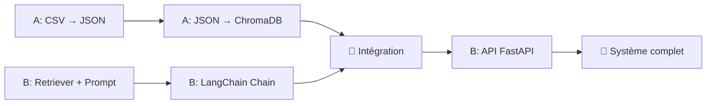

# Répartition des Tâches — Projet RAG Orientation

> **Équipe** : 2 personnes · **Outil** : Git + GitHub
> **Date** : 11/02/2026

---

## Structure du repo Git

```
orientation-rag/
├── README.md
├── requirements.txt
├── .gitignore
│
├── data/                      ← Personne A
│   ├── raw/                   # CSV bruts (licences, masters)
│   ├── processed/             # JSON structurés (par formation)
│   └── scripts/
│       ├── process_csv.py     # Extraction CSV → JSON partiel
│       ├── enrich_llm.py      # Enrichissement LLM → JSON complet
│       ├── validate_data.py   # Validation Pydantic
│       └── load_vectorstore.py # Chargement ChromaDB
│
├── rag/                       ← Personne B
│   ├── retriever.py           # Recherche vectorielle (ChromaDB)
│   ├── prompt_builder.py      # Construction du prompt LLM
│   ├── chain.py               # Pipeline LangChain complet
│   └── models.py              # Modèles Pydantic (profil, formation, parcours)
│
├── api/                       ← Personne B
│   ├── main.py                # FastAPI app + endpoints
│   ├── schemas.py             # Schémas request/response
│   └── config.py              # Config (clés API, paramètres)
│
├── tests/                     ← Les deux
│   ├── test_data.py
│   ├── test_rag.py
│   └── test_api.py
│
└── docs/
    └── variables_essentielles.md  # Document de référence partagé
```

---

## Personne A — Data & Vector Store

**Responsabilité** : Tout ce qui touche aux **données** (CSV → JSON → ChromaDB)

### Tâches ordonnées

| # | Tâche | Branche Git | Livrable |
|---|---|---|---|
| 1 | Initialiser le repo + structure de dossiers | `main` | Repo prêt |
| 2 | Créer les modèles Pydantic partagés (`models.py`) | `feature/models` | Schémas validés |
| 3 | Script `process_csv.py` — extraction directe des CSV | `feature/data-extraction` | JSON partiels (~600 formations) |
| 4 | Script `enrich_llm.py` — enrichissement des variables manquantes | `feature/data-enrichment` | JSON complets |
| 5 | Script `validate_data.py` — vérification de cohérence | `feature/data-validation` | Rapport qualité |
| 6 | Script `load_vectorstore.py` — indexation ChromaDB | `feature/vectorstore` | Base ChromaDB prête |
| 7 | Tests unitaires data (`test_data.py`) | `feature/tests-data` | Tests passants |

### Fichiers touchés
`data/`, `rag/models.py`, `tests/test_data.py`

---

## Personne B — RAG Engine & API

**Responsabilité** : Tout ce qui touche au **moteur RAG** et à l'**API**

### Tâches ordonnées

| # | Tâche | Branche Git | Dépendance |
|---|---|---|---|
| 1 | `retriever.py` — module de recherche ChromaDB | `feature/retriever` | Attend les modèles Pydantic (A.2) |
| 2 | `prompt_builder.py` — construction du prompt enrichi | `feature/prompt` | Indépendant |
| 3 | `chain.py` — pipeline LangChain (retriever + prompt + LLM) | `feature/rag-chain` | Après B.1 et B.2 |
| 4 | `main.py` + `schemas.py` — API FastAPI | `feature/api` | Après B.3 |
| 5 | `config.py` — gestion des clés API et paramètres | `feature/config` | Indépendant |
| 6 | Tests RAG + API (`test_rag.py`, `test_api.py`) | `feature/tests-rag` | Après B.3 et B.4 |

### Fichiers touchés
`rag/`, `api/`, `tests/test_rag.py`, `tests/test_api.py`

---

## Point de jonction (intégration)



> [!IMPORTANT]
> **Le point de jonction critique** est quand la **base ChromaDB** (Personne A) est prête et que le **retriever** (Personne B) peut s'y connecter. Planifiez une session commune à ce moment.

---

## Workflow Git

### Branches
- `main` — code stable uniquement (merges validés)
- `develop` — branche d'intégration
- `feature/*` — une branche par tâche (voir tableaux ci-dessus)

### Processus quotidien
```bash
# 1. Mettre à jour sa branche
git checkout develop
git pull origin develop
git checkout feature/ma-tache
git rebase develop

# 2. Travailler et committer
git add .
git commit -m "feat(data): extraction CSV licences → JSON partiel"

# 3. Pousser et créer une PR
git push origin feature/ma-tache
# → Créer une Pull Request vers develop sur GitHub
```

### Convention de commits
```
feat(data): ajout extraction CSV masters
feat(rag): implémentation retriever ChromaDB
fix(api): correction validation profil étudiant
docs: mise à jour variables_essentielles.md
test: ajout tests unitaires data processing
```

---

## Planning suggéré

| Semaine | Personne A (Data) | Personne B (RAG & API) | Sync |
|---|---|---|---|
| S1 | Init repo + Modèles + Extraction CSV | Prompt builder + Config | Valider modèles ensemble |
| S2 | Enrichissement LLM + Validation | Retriever + Chain LangChain | **Point de jonction** : ChromaDB prête | 
| S3 | Chargement ChromaDB + Tests data | API FastAPI + Tests RAG | Intégration complète |
| S4 | Documentation + Corrections | Documentation + Corrections | **Demo finale** |
